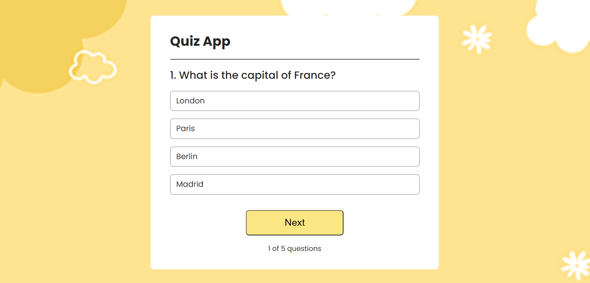
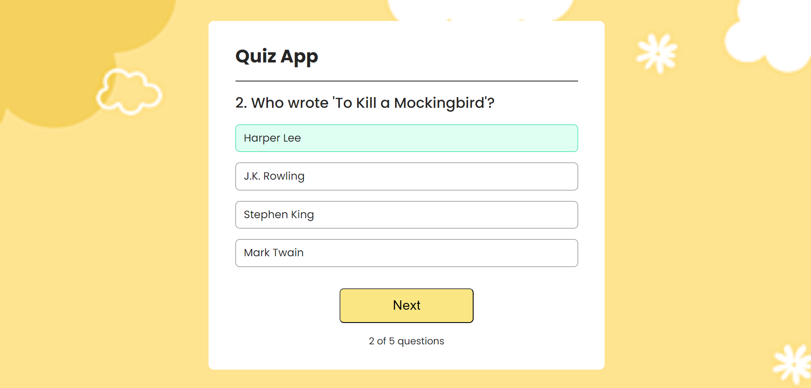
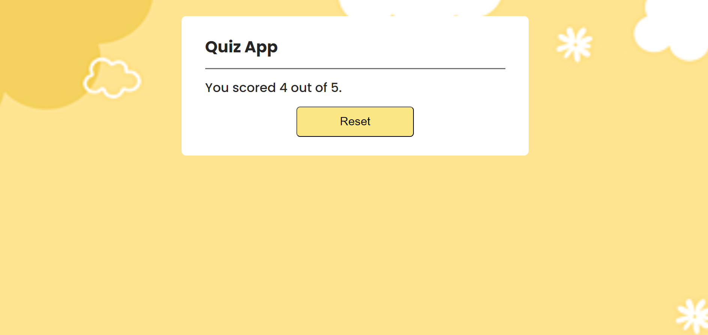

# Quiz App

Welcome to the Quiz App! 
This project is a React.js application created for practicing and enhancing my React skills. It features a dynamic quiz interface where users can test their knowledge on various topics. Dive in and have some fun while learning!

## Table of Contents
- [Features](#features)
- [Technologies Used](#technologies-used)
- [Installation](#installation)
- [Usage](#usage)
- [Screenshots](#screenshots)

## Features
- User-friendly
- Responsive design
- Score tracking

## Technologies Used
- React.js
- CSS3
- HTML5

## Installation
To get a local copy up and running, follow these steps:
1. Clone the repository:
    ```bash
    git clone https://github.com/Jasmine5220/quiz-app.git
    ```

2. Navigate to the project directory:
    ```bash
    cd quiz-app
    ```

3. Install the dependencies:
    ```bash
    npm install
    ```

4. Start the development server:
    ```bash
    npm start
    ```

5. Open your browser and go to `http://localhost:3000` to view the app.

## Usage
- Get real-time feedback and review your score at the end.
- Track your score and improve your knowledge.

## Screenshots

### Quiz Page


### Quiz Page


### Results Page



---

Happy Coding! 😊

---
